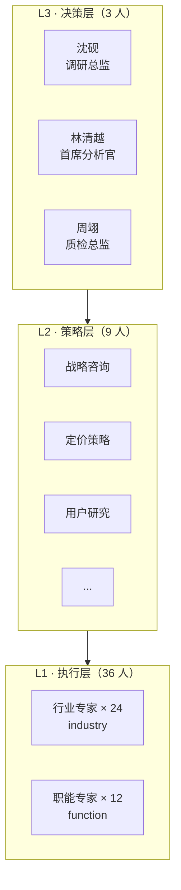

# Agent 角色与协议 · Agents

本文档描述常青圈 EvergreenCircle 的多 Agent 体系：专家分层、角色职责、消息协议与四条铁律。

---

## 1. 设计理念

本系统把调研建模为一支**虚拟咨询团队**的协作过程。系统内置 **48 位虚拟专家 × 2 个域**
（目的地调研见 [experts.json](../backend/app/data/experts.json)，生活圈体检见
[experts_living_circle.json](../backend/app/data/experts_living_circle.json)），按职级分为三层。
每次调研由编排引擎根据需求**自动组队**：决策层拆解与终审，策略层与执行层负责具体分析与采集。

> 两个产品域共用这套分层与协议，但**各域有自己的名册与组队实现**：目的地调研用
> `experts.json`，生活圈体检用 `experts_living_circle.json`（同为 48 条、同一 id 空间，
> 同 id 在不同域是不同人设），并由 `app/core/pipeline/lc_team.py` 从中挑选成员。
> **取域是必填的**：`app.data.load_experts(domain)` / `expert_by_id(id, domain)` /
> `experts_by_level(level, domain)` 没有默认域，未知域名直接抛错；HTTP 侧
> `/api/experts`、`/api/experts/workload`、`/api/experts/{eid}` 收到非法 `?domain=` 返回 422
> （缺省＝travel 是对外公开契约，没改）。同 id 两域人设不同 ⇒ 任何"按姓名反查 id"都不可用：
> 实测存在跨域重名（travel `L2-005` 与 living_circle `L3-001` 都叫「温叙白」）。
> 域包泛化（换域只换名册不换代码）见 [ARCHITECTURE.md](./ARCHITECTURE.md)。

> 注：这里的「专家」是带有领域知识画像（`knowledge_base` / `knowledge_tags`）的角色设定，用于驱动 LLM 以对应专业视角生成论点与分析，并体现在工作台、专家页与报告署名中。

---

## 2. 专家分层

### 2.1 目的地调研域（`experts.json`）



| 层级 | 人数 | 分组 | 职责 |
|---|---|---|---|
| **L3 决策层** | 3 | decision | 统筹全局、终审签发、质检裁决 |
| **L2 策略层** | 9 | strategy | 战略 / 定价 / 用户研究等策略级分析 |
| **L1 执行层** | 36 | industry(24) + function(12) | 行业与职能维度的具体采集与分析 |

### 2.2 生活圈体检域（`experts_living_circle.json`）

层级与人数**逐档同构**（L3 3 / L2 9 / L1 36），差别只在 L1 的两个分组换成了本域的槽位：

| 层级 | 人数 | 分组 | 职责 |
|---|---|---|---|
| **L3 决策层** | 3 | decision | 总检统筹、结论裁定、质检复核 |
| **L2 策略层** | 9 | strategy | 医疗 / 教育 / 养老 / 商业等设施类别的配置顾问 |
| **L1 执行层** | 36 | **facility(24) + method(12)** | 设施类别维度的采集与方法维度（定位、POI 核验、测时、评分建模） |

### L3 决策层（两域各三位，同 id 不同人设）

| ID | 调研域 | 生活圈域 |
|---|---|---|
| L3-001 | 沈砚 · 调研总监 —— 拆解需求、组建专家队、终审并签发报告 | 温叙白 · 社区体检总检 —— 定格中心点与参数、组队、终审体检报告并签发 |
| L3-002 | 林清越 · 首席分析官 —— 把控分析质量与逻辑严谨性 | 许映川 · 首席规划分析师 —— 把控设施覆盖与评分建模的逻辑严谨性 |
| L3-003 | 周翊 · 质检总监 —— 魔鬼代言人，事实校验与返工闭环 | 裴砚秋 · 质检总监 —— 对 POI 溯源、采样点可达率、盲区判定逐一复核 |

每位专家含字段：`id` `level` `group` `name` `role_title` `one_liner` `skills` `knowledge_base` `knowledge_tags` `avatar` 等。

---

## 3. 角色到流水线的映射

### 3.1 目的地调研（`pipeline/research/`）

| 流水线节点 | 主导层级 | 说明 |
|---|---|---|
| intake / orchestrator | L3 决策层 | 总监拆解需求、组队、排计划 |
| collect | L1 执行层 | 行业/职能专家按角度采集证据（`collected_by` ＝ 实际采集的团队成员 id） |
| analyze | L2 + L1 | 策略与执行层基于证据产出论点与结构化对象 |
| write | L2 + L1 | 论断作者取自队内 `L1*`/`L2*` 成员（`analyze.py` 的 `authors`，兜底 `L2-001`）；出镜数由 `bump_expert_stats` 按作者计数累计 |
| audit | L3 质检总监 | 事实校验、覆盖度评估、决定是否返工 |
| done | L3 调研总监 | 终审签发 |

### 3.2 生活圈体检（`pipeline/living_circle.py` + `lc_team.py` + `diagnosis_templates.py`）

**署名级编排**：专家团只在 plan 阶段产出「成员 + 指派理由」，等时圈 / POI / 评分 / 盲区
全部是确定性规则，没有任何一步由专家执行 —— 这是设计选择。因此"章节谁写的"是一张
**固定席位表**，而不是动态分工的结果：

| 报告章节（`id` · 屏上标题） | 署名席位 | 域 |
|---|---|---|
| `medical` 医疗配置 | L2-001 | living_circle |
| `education` 教育设施 | L2-002 | living_circle |
| `elderly` 养老配置 | L2-003 | living_circle |
| `market` 菜市与购物 | L2-004 | living_circle |
| `isochrone` 可达性与等时圈 | L2-005 | living_circle |
| `blindspot` 服务盲区诊断 | L3-002 | living_circle |
| `conclusion` 体检结论与整改建议 | L3-001 | living_circle |

（`overview` 体检概览不带论断作者，故不在表内。）

三条实测口径，写代码或写文档时都别记错：

1. 席位名一律由 `diagnosis_templates._expert()` **固定取 living_circle 域**派生 —— 早先它
   走默认域，导致一份真报告 7 章署名 7/7 是旅游人设（现存报告已由
   `scripts/normalize_report_signatures.py` 按结构性 id 直写规范化完毕）。
2. 组队降级**必须可见**：`lc_team` 返回 `(ids, reasons, degraded)`，`degraded ∈
   ""|llm_error|team_too_small`，plan 阶段以 `message` 事件 `kind:'team'` 带 `members`/`degraded`
   发前端常驻显示。**不新增事件 type**（新增 type 若未进前端 union，传输层按 union 穷举会静默丢弃）。
3. 证据的 `collected_by` 目前是**硬编码常量**（粗报写槽位 id、精报模板写姓名），且前端
   **零消费者** —— 别把它当"谁采的"的可信字段用；要上屏之前先统一成 id 并补派生。

---

## 4. 消息协议（Envelope）

Agent 间通过结构化信封 `Envelope`（[models.py](../backend/app/core/models.py)）传递任务，避免自由文本带来的歧义：

```python
@dataclass
class Envelope:
    msg_id: str
    sender: str       # 发送方 agent_id
    receiver: str     # 接收方 agent_id
    task_type: str    # PRODUCE（生产）| REWORK（返工）| PASS（通过）
    payload: dict     # 任务载荷
    issues: list      # 质检发现的问题（Issue 列表）
    trace_ref: str    # 关联的 Trace span
```

质检发现的问题用 `Issue` 描述：

```python
@dataclass
class Issue:
    issue_id: str
    target: str       # 指向 claim_id 或 section
    severity: str     # high | medium | low
    reason: str       # 问题原因
    raised_by: str    # 提出方 agent_id
```

返工闭环：质检（audit）发现证据不足 → 发 `REWORK` 信封打回 collect 补采；维度缺失 → 打回 analyze 重分析。每轮返工后重算质量指标，记录 `issues_resolved` 与前后 metrics delta。

---

## 5. 证据与论点

### Evidence（证据）

每条采集到的证据都带可信度与时效（见 [credibility.py](../backend/app/core/credibility.py)）：

```
evidence_id · source_url · source_type · title · excerpt · captured_at
credibility(0-100) · collected_by · brand · domain · freshness_days
```

`source_type` 覆盖：`official` `news` `financial_report` `zhihu` `bilibili` `weibo` `xiaohongshu` `douyin` `review`。

### Claim（论点）

每个论点必须挂证据，置信度由 `make_claim` 按规则计算：

| 条件 | 置信度 |
|---|---|
| 无任何证据 | `unverified` |
| ≥ 2 个独立域名交叉验证 | `high` |
| ≥ 2 条证据（同源） | `medium` |
| 仅 1 条证据 | `low` |

---

## 6. 四条铁律

整个 Agent 体系遵循四条不可违背的原则：

1. **无证据不立论**：任何结论必须挂接证据 ID，否则标记 `unverified`，绝不编造。
2. **交叉验证**：关键论点要求 ≥ 2 个独立域名佐证才可判为高置信。
3. **返工闭环**：质检不达标必须打回补采或重分析，而非降低标准放行。
4. **可观测**：每个 Agent 的 Prompt、输入输出、Token、决策、引用证据全部落 Trace，可查可回放。

> 这四条铁律是「让每个结论都有出处」这一产品理念的工程化落地。

---

## 7. 量的出处 · 术语表（写代码与写文案前先看这一节）

生活圈体检同时使用**两把互不换算的尺**。把它们混成一个词，是本域已经犯过三次、并且
每次都要靠人肉才能发现的根因，所以词汇在这里定死。

### 7.1 两把尺

| 名字 | 怎么量 | 唯一生产者 | 落库位置 |
|---|---|---|---|
| **可达尺** | 实测步行耗时 + 可达区多边形封顶（`reach_full_min`，今天 20min） | `assemble.py` 的 `field_fn` | `poi.categories[].in_circle` / `min_minutes`、`scores.triads[].in_reach` |
| **1km 直线尺** | 格心到该类设施的直线距离 ≤ `blind_radius_m`（1000m） | `blindspot._verdict_masks` | `blindspots[].nearest[].distance_m`、逐格台账 `present.*` / `nearest.*`、`scores.triads[].within_blind_radius` |

两把尺**刻意不做换算**（`docs/多源POI数据清洗与服务盲区识别算法.md` 已写明"两把独立的尺"）。
实测参考量：15min 圈等面积半径 ≈705m（凯里）/748m（劲松），20min ≈934m/1023m，而判盲半径
1000m —— 也就是说 **1km 那把尺约等于 20min 可达尺，不等于 15min**。

**派生出来的第三把：残差耗时（受阻代理）** —— 它不是新的原始测量，而是把可达尺那个标量拆开：
`残差 = 实测分钟 −（直线米数 × 本次标定的常态绕行系数 ÷ 声明速度）`。

| 项 | 值 |
|---|---|
| 唯一生产者 | `isochrone.detour_residual`（零外呼，只吃已落库的采样点） |
| 落库位置 | `sampling.detour`（标定系数 / 隐含系数 p10-p90 / 入样点数 / 三类剔除计数 / 残差分钟分位） |
| 口径版本键 | `caliber.reach_caliber_version`（`rc-*`，定义在 `caliber.REACH_CALIBER_VERSION`） |
| 唯一上屏出口 | 前端 `lib/livingCircle.residualCaliberNote`（缺键或无样本 ⇒ `null`，整块不出现） |

三条纪律：**① 只按分钟呈现，不许换算成百分比**（那会把一次减法重新写成除法，也让"远"和"堵"
重新粘在一起）；**② 是代理量，不指认因果**——河道、铁路、封闭街区与单次测时噪声在这份数据里
不可区分，对外一律写「残差耗时 / 受阻代理」，不宣称微观可达性精度；**③ 剔除的点要计数上屏**
（中心点、未测时、零耗时三类），不许静默丢。实测标定值：凯里 1.620、劲松 1.529，而口径表声明
的是 1.3、文献 +14%≈1.14 —— 三者并列披露，不挑一个当唯一真值。

### 7.2 `covered` 一词三义（**按名字搜会全错，必须按字段路径认**）

| 出现处 | 字段 | 真语义 | 属于哪把尺 |
|---|---|---|---|
| `scoring.triad_from_points` → `scores.triads[]` | `covered` | 可达区内有该类设施（= `in_reach` 的兼容别名） | **可达尺** |
| `blindspot` 的 not_blind 判定 | —— | 该类在格心 1km 圆内有设施 | **1km 直线尺** |
| `anchors.PLAN_COVERED = "covered"` | 取证规划的五种停手原因之一 | 该类证据盘在可达区内**每格都判得动**（无需再扩） | 证据面，不是可达也不是 1km |

⚠️ 三者**没有任何关系**。历史事故：`diagnosis_templates.py` 把第一义当第二义写进正文
（「药店三要素 1km 内缺失」），于是直线 950m、隔河需 35min 的药店被报成"1km 内没有"，
而同一份报告的 `blindspots[].nearest[]` 里就躺着它的 `distance_m` —— 一句假话。

### 7.3 唯一出口与禁令

三要素的结论**只许**经这几个渲染器产出，两侧措辞逐字对齐并由
`frontend/src/__tests__/triadProseMirror.test.ts` 跨端钉住：

- 后端 `diagnosis_templates.py`：`_triad_state` / `_triad_takeaway` / `_triad_claim` /
  `_triad_overview` / `_triad_school_para`
- 前端 `lib/livingCircle.ts`：`triadState` / `triadChipText` / `triadChipTone` /
  `TRIAD_CHIP_CLASS`（chip 的配色也只许这一份，三个渲染面共用）/
  `triadTakeawayText` / `triadClaimText` / `triadOverviewText` / `triadSchoolParaText`
- 残差耗时那句（第三把派生尺）：前端 `lib/livingCircle.ts` 的 `residualCaliberNote` 一颗，
  两处渲染面（体检台右栏、报告体检单）都调它；它**不在**后端正文模板里另写一份 —— 判读辅助句
  归前端这一条与 `judgeRulerLabel`（判定尺那句）同例。

五态：`reachable` / `blocked`（1km 内有但步行到不了）/ `absent` / `unknown` / `missing`。
**`unknown` 是一等状态，不许塌成 `false`** —— 旧快照没有 `within_blind_radius` 这一格时读作
`unknown`，报"1km 内没有"就是伪造负结论（与逐格台账 `present` 用 int8 `-1/0/1` 而非 bool
是同一条纪律，见 `judgement.py` 的 ⚠️）。

写文案时的硬禁令（守卫会红）：

1. 章节函数里**不许**出现「1km」字面量 —— 1km 的说法只能出自上面的渲染器。
2. 不许再手写 `covered ? … : '1km 内缺失'` 这类三元式（守卫按特征现扫 `src/` 全部渲染面，
   不点名文件 —— 新增一个卡片面不需要有人记得把名字加进列表）。
3. 正文里凡「圈内」一律写**「可达区内」**，不要出现「15 分钟圈内」——可达阈值是
   `caliber.reach_full_min`（今天 20min，是刻意的满分线），15min 只是四档等值线之一。
4. 盲区章的「1km」是**真** 1km（由 `missing_facilities` / `nearest[].distance_m` 驱动），
   合法，不要顺手改掉。
