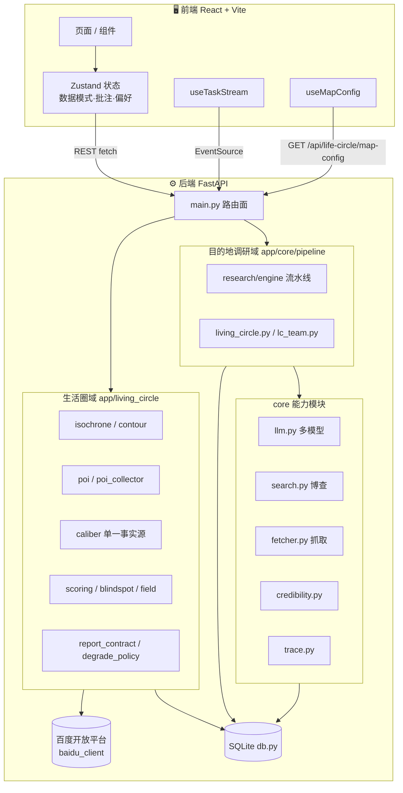
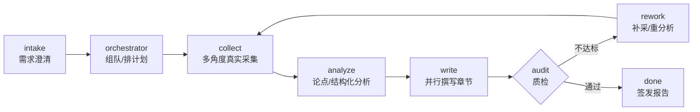

# 系统架构 · Architecture

本文档描述常青圈 EvergreenCircle 的整体架构、两个产品域、地图链路与关键数据流。
部署与端口见 [DEPLOYMENT.md](./DEPLOYMENT.md)，Agent 分层与消息协议见 [AGENTS.md](./AGENTS.md)。

> **写作纪律**：本文只描述「结构」与「为什么这样切」，凡是会漂移的数字（模型名、并发、
> 配额、章节数、阈值）一律指向真值源文件，不在此复制。上一版架构文档就是因为把
> `MODE_CONFIG` 与旧 IA 抄进正文，代码演进后整篇变成假话。

---

## 1. 总览

前后端分离，**后端只有一份代码真相 `backend/`**（曾经的 Vercel Serverless 镜像 `api/` 已删除，
见 [DEPLOYMENT.md](./DEPLOYMENT.md) §5）：

- **前端** `frontend/`：React 19 + Vite 单页应用，经 REST + SSE 与后端通信。
- **后端** `backend/`：FastAPI + SQLite，内含多 Agent 编排、真实联网采集、等时圈几何计算、
  可信度评分、可观测 Trace 与口径（caliber）单一事实源。



---

## 2. 两个产品域

同一套 Agent 骨架承载两个域，**互不共享业务代码，只共享 `core/` 能力与 Trace/证据底座**：

| 域 | 代码位置 | 产出 |
|---|---|---|
| **生活圈体检**（产品本体） | `app/living_circle/`（21 模块）+ `app/core/pipeline/living_circle.py`、`lc_team.py`、`diagnosis_templates.py` | 等时圈、设施覆盖、盲区、0–100 评分与章节化诊断报告 |
| **目的地调研**（fork 继承能力） | `app/core/pipeline/research/`（`engine.py` 编排 + `collect/analyze/writer/spots/assemble/charts_build/perspective/planning/dispatch/modes/_util/runtime/errors`） | Deep Research 报告、证据溯源、结构化对象 |

### 生活圈域的关键切分

- **口径单一事实源 `caliber.py` / `caliber_index.py`**：出行方式、速度、绕行系数、网格粒度
  等"算法口径"只在这里定义，报告与评分都从这里取值并随报告落一份 `caliber` 举证对象 ——
  任何数字都要能回答「按什么口径算的」。
- **几何与采集分离**：`isochrone.py`（渔网采样 + 批量算路 + IDW 插值）与 `contour.py`（等值线）
  只产几何；`poi.py` / `poi_collector.py` 只产设施事实；`scoring.py` / `blindspot.py` /
  `field.py` 在其上做判定。
- **契约前移**：`report_contract.py` 在**落库前**判几何与举证契约（圈外点、采集半径、口径可举证），
  `degrade_policy.py` 决定降级形态 —— 不合格的报告不入库，而不是入库后再靠前端遮。
- **配额与闸**：`quota.py` + `request_guard.py` + `baidu_client.py` 构成进程级共享闸
  （唯一工厂拿闸，这条纪律由 `scripts/check_guard_construction.py` 在 CI 期机器校验）。

---

## 3. 目的地调研流水线

由 `app/core/pipeline/research/engine.py` 驱动：



三档调研模式（快速 / 深度 / 专家级）在搜索角度数、每角度抓取数、章节集、模型档位、
freshness 与写作深度上分档 —— 具体取值以 `pipeline/research/modes.py` 的 `MODE_CONFIG` 为准。

**依赖方向是机器校验的**（`check_guard_construction.py` 的 G-5/G-6/G-7）：流水线内层不得回握
`orchestrator`/`runner`；外壳只许依赖 `research.engine` 公共面；research 子模块不得回边 import
`engine`。违反即 CI 红，不靠人记。

---

## 4. 多模型编排

LLM 调用统一经 `app/core/llm.py`，按任务类型分档以利用各模型并发额度
（默认值真值源 `app/core/config.py`，切厂商只需改 base_url/key/model，或走「模型配置」页）：

| 档位 | 默认模型 | 用途 | 并发 |
|---|---|---|---|
| core | `glm-5.2` | 核心章（摘要/功能/定价/结论/创新章） | 10 |
| aux | `glm-5.1` | 辅助章（格局/画像/趋势/SWOT/风险） | 10 |
| fast | `glm-z1-air` | 杂务（intake/澄清/情感分类/单条重写） | 30 |

单次调用超时与重试同样以 `config.py` 为准（重型 JSON 产出耗时长，重试次数刻意压低以免
最坏情况叠加成 3×timeout）。写作阶段各章并行，单章独立 token 预算与模型，
**单章失败不影响其它章节**。

---

## 5. 地图链路（AK 与底图纪律）

**浏览器端 AK 只有一个来源**：后端 `GET /api/life-circle/map-config`
（`app/main.py` 的 `life_circle_map_config()`）下发 `BAIDU_BROWSER_AK` 与可选的
`BAIDU_MAP_STYLE_ID`；前端唯一入口是 `lib/bmap.ts` 的 `getMapConfig()`，
组件侧经 `hooks/useMapConfig.ts` 取用（模块级缓存，只缓存「取到的那一次」，
后端不可达时不固化失败结果）。

- 服务端 AK（`BAIDU_SERVER_AK`）只给后端调用（地理编码 / POI / 路线 / 批量算路），
  **不能用于 JS API**（服务类型与 Referer 白名单都不匹配）。
- 浏览器 AK 是公开键，靠百度控制台的 Referer 白名单限域。
- JSAPI 加载器全项目唯一：`loadBMapGL()`（必须带 `type=webgl`，否则百度返回经典版、
  `window.BMapGL` 永不存在 ⇒ 必然降级）。曾经报告侧另有一份私有加载器与另一套
  构建期变量，导致地图页有图、报告只有占位 —— 已收敛。
- **底图注记纪律活在代码里**：`lib/bmapStyle.ts` 内置 styleJson 模板整层关闭底图 POI 注记
  （保留路名与行政区名）。`setMapStyleV2` 的 `styleId` 与 `styleJson` 互斥二选一，
  默认不下发 styleId —— 第三方设施名与我们的 Marker 同款呈现会被读成自家数据，
  这是数据可信度问题而非配色偏好。

---

## 6. 数据模式与降级

三态，**运行时可切**（侧边栏「数据模式」，选择记在 localStorage）：

| 模式 | 数据来源 | 等时圈 |
|---|---|---|
| live（真实联调） | 后端 + 百度开放平台真实调用 | 真实路网批量算路 |
| fixture（演示） | 内置双样例（凯里老街 / 北京劲松） | 内置快照 |
| offline 估算 | 有中心无 AK / 配额受限 | 圆形近似，**报告须如实标注来源** |

降级不是"失败"而是"另一种诚实形态"：`degrade_policy.py` 决定形态，`data_source.py` 决定取数，
报告侧带 `data_origin` / `served_from` 徽标，让读者看得见这份数据从哪来。
`ENABLE_DEMO_FALLBACK` 控制无 LLM key 时是否走演示兜底。

---

## 7. 实时通信：SSE 思维流

工作台经 `GET /api/tasks/{task_id}/stream`（Server-Sent Events）接收流水线事件：
`node_update`（节点状态）· `thought`（思考/发现，带 kind 与 expert）· `message`（结构化消息，
含返工）· `evidence`（新证据）· `chart` / `image` · `progress` · `trace` ·
`report_ready` / `done` / `error`。

**执行与传输解耦**（`app/core/runner.py`）：任务生命周期不等于 HTTP 连接生命周期，
代理超时或断连只影响展示层，`runner` 在 worker 进程内独立驱动，前端重连 + 回放缓冲续看。
代价是 `runner._running` 为进程内存任务表 ⇒ **worker 必须单实例、`--workers 1`**（见
[deploy/README.md](../deploy/README.md) §7）。

---

## 8. 可观测性 Trace

每次 LLM 调用在 `app/core/trace.py` 落一条 `TraceSpan`：
`span_id · task_id · seq · agent_id · stage · purpose · model · prompt(摘要) · response(摘要) ·
token 三项 · latency_ms · decision · evidence_ids · ts`。

埋点是**无侵入**的（不要求给每个 `chat()` 改签名）。落 `traces` 表后有三个消费面：
工作台悬浮面板实时滚动、报告页「决策回放」按 `seq` 步进高亮对应 Agent 与引用证据、
独立 `/trace/:reportId` 页查询每个 Agent 的 Prompt/输出/Token/决策。

---

## 9. 数据持久化

SQLite（`app/core/db.py`），12 张表：

| 表 | 内容 |
|---|---|
| `tasks` | 任务、澄清答案、模式 |
| `reports` | 调研报告全文 JSON（sections/trace/metrics/structured/data_grid） |
| `living_circle_reports` | 生活圈体检报告 |
| `lc_cache` | 生活圈采集/算路缓存（省配额、可复现） |
| `evidences` | 全局证据溯源库（可信度、时效、来源） |
| `traces` | 可观测决策链路 |
| `subscriptions` | 监控订阅 |
| `report_feedback` | 人工修正反馈（→ 业务闭环指标） |
| `expert_stats` | 专家席位统计 |
| `destination_discovery_cache` | 目的地发现缓存 |
| `prefs` / `settings` | 用户偏好与运行时配置（运行时改配置走 `/api/settings`，落库持久） |

报告整份 JSON 一次下发（`GET /api/reports/:id`），前端零额外请求即可渲染 trace / metrics /
结构化对象。库路径由 `VERDA_DB_PATH` 决定（默认 `backend/app/data/verda.db`），已开 WAL。

---

## 10. 前端结构

```
src/
├── pages/        # 16 个页面
├── components/   # V 前缀通用组件；lifecircle/ 放地图与体检视图
├── layout/       # AppLayout（带侧边栏）/ VSidebar
├── store/        # Zustand：数据模式、批注、偏好、任务名册、UI
├── hooks/        # useTaskStream（SSE）· useMapConfig（地图 AK/styleId）
├── lib/          # api.ts（REST+SSE）· bmap.ts（JSAPI）· bmapStyle.ts（底图纪律）· caliber 消费面
├── __tests__/    # Vitest；helpers/bmapGLFake.ts 是全套件唯一 BMapGL 替身出口
└── dev/          # 取证探针页逻辑（不被入口引用 ⇒ 不进生产包，但进 tsc 与 eslint）
```

路由分两类（真值源 `src/App.tsx`）：带侧边栏的常规页（首页向导 / 生活圈地图 / 双样例对比 /
报告中心 / 专家团 / 历史 / 模型配置）与全屏沉浸页（澄清 / 工作台 / 报告 / 幻灯片 / 图谱 / Trace）。
`/library`、`/knowledge` 已移出主导航但保留深链。

品牌称谓唯一真源 `src/lib/brand.ts`，`index.html` 的 `<title>` 由 `brand.test.ts` 钉住不漂移。

---

## 11. 专家团与域包

48 位虚拟专家分三层（L3 决策 3 / L2 策略 9 / L1 执行 36），分层、角色与消息协议见
[AGENTS.md](./AGENTS.md)。两个域各有一份名册（`app/data/experts.json` 与
`experts_living_circle.json`），**同构、共用同一 48 id 空间**：id 是职能槽位，人设是域包内容，
所以同 id 在不同域可以是不同人设。

组队按域独立实现：目的地调研由编排引擎自动组队；生活圈由 `pipeline/lc_team.py` 从名册中
按需挑选 8–13 人（替代早先硬编码的固定名单）。口径绑定挂在**职能槽位**上而非人设上，
这样换一个领域只需换名册与绑定，不必改核心代码。

---

## 12. 测试与守卫（结构约束的机器化）

本仓的架构约束不靠文档约定，靠三类可执行守卫：

| 层 | 位置 | 守什么 |
|---|---|---|
| γ 静态守卫 | `backend/scripts/check_guard_construction.py`（AST，非正则） | 治理闸不得被绕过、断言不得读挂钟、`from_iso` 唯一出口、流水线 import 方向 |
| 等价类套件 | `backend/tests/test_guard_construction_lint.py` | 上述每条规则「违规必红 + 合法必绿」 |
| 元守卫自证 | `backend/tests/test_guard_selfvalidation.py`、`tests/test_api_mirror_guard.py`、`tests/test_semantic_residue.py` | **守卫在比对对象消失时必须报错或显式 SKIP，不得静默报绿** |

外加词表闸（`test_expert_caliber_refs.py`）、注册表单一真相源（`test_registry_single_source.py`）、
前后端夹具契约（`test_fixture_mirror.py`）、前端样式与色 token 完整性
（`tailwindClassIntegrity.test.ts`、`bmapStyle.test.tsx`、`roadContrast.test.ts`）。

判别力机器：`backend/scripts/mutation_check.py` —— 往生产代码注入变异，断言目标用例**转红**，
再按 sha256 校验还原。全绿只说明"当前代码让测试满意"，不说明"测试真的在检查东西"。
